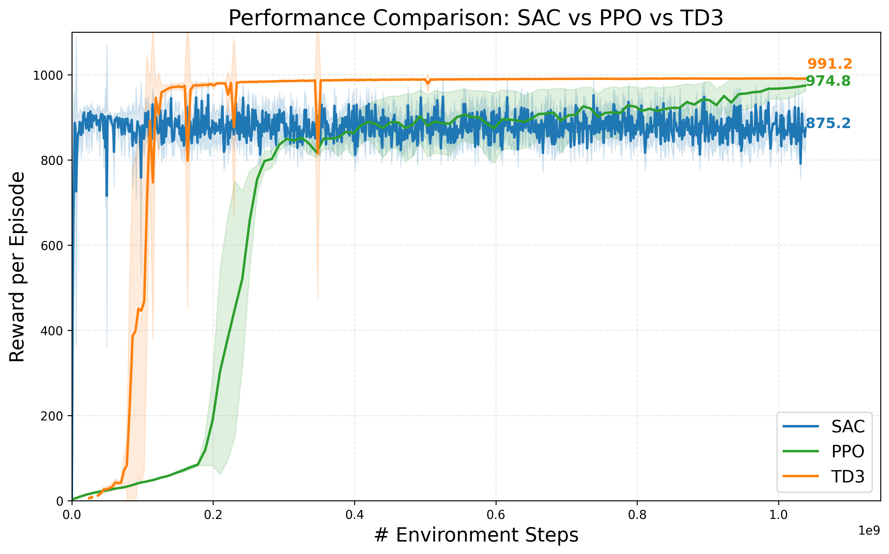
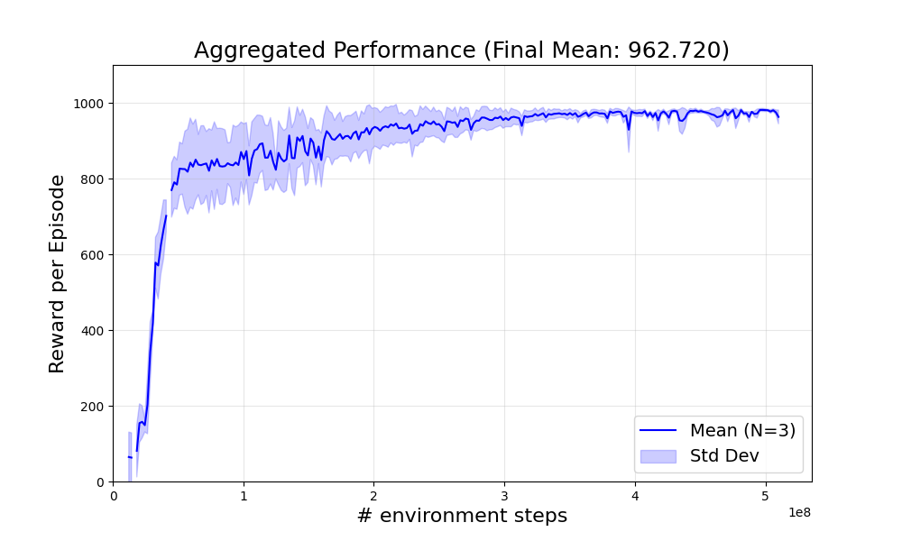

# Humanoid Locomotion with Deep Reinforcement Learning

Comparing **PPO**, **Soft Actor-Critic (SAC)**, and **TD3** for humanoid locomotion in the MuJoCo
physics engine on flat ground, and on procedurally generated uneven terrain.


*The uneven-terrain environment: a procedurally generated heightfield replaces the default flat plane.*

## Results

Mean reward per episode, evaluated over 100 episodes per seed after hyperparameter tuning.

| Algorithm | Environment | Mean reward / episode | Seeds |
|-----------|-------------|----------------------:|------:|
| **TD3**   | HumanoidWalk (flat)      | **991** | 5 |
| PPO       | HumanoidWalk (flat)      | 974 | 5 |
| SAC       | HumanoidWalk (flat)      | 875 | 5 |
| TD3       | HumanoidWalk + obstacles | 962 | 3 |



**What we found**

- **TD3 performed best on the base task.** Its deterministic policy lets the agent settle into a
  precise, consistent gait, while clipped double Q-learning and target policy smoothing keep training
  stable. The reward curve is notably flat at the top.
- **SAC was the most sample-efficient early** expected from an off-policy method that reuses data —
  but its maximum-entropy objective keeps it exploring, producing high variance across seeds and the
  lowest asymptotic reward.
- **PPO converged slowest**, since on-policy training needs fresh data for every update, but its
  trust-region updates produced a smooth monotonic rise that eventually overtook SAC.
- **On uneven terrain, TD3 still learned to traverse** (962), but with slower convergence and much
  higher variance in early training, reflecting the harder physics interactions. Note this run used
  3 seeds against 5 for the baseline, so the comparison is indicative rather than strict.



### Environment modifications

The flat plane is replaced with a procedurally generated heightfield giving small bumps and slopes.
The reward function was adjusted so that progress is measured along the surface rather than the
horizontal plane:

- Standing height is measured **relative to the feet** (`h_rel = h_head − h_feet`), so the standing
  reward stays consistent on slopes.
- Forward velocity is **projected onto the local tangent plane** (`v_forward = v_tan · f_torso`),
  so the agent is not penalised for climbing and does not learn to avoid hills.

## Implementations used

This project is a comparative evaluation; the algorithm implementations are third-party:

- **PPO and SAC** — [MuJoCo Playground](https://playground.mujoco.org/) (Brax-backed, highly parallel)
- **TD3** — [FastTD3](https://arxiv.org/abs/2505.22642) (Seo et al., 2025), optimised for humanoid control

Training runs were tracked with [Weights & Biases](https://wandb.ai/) (`--use_wandb`).

## Contributors

This was a three-person course project (ECE1508: Reinforcement Learning, Fall 2025,
University of Toronto).

- **Aiden Rosebush** found and organised the initial PPO, SAC, and TD3 implementations; wrote the
  majority of the final report.
- **John (Chang-Won) Lee** completed the implementations, added multi-GPU training support, and
  explored hyperparameter tuning.
- **David Marcovitch** extended the flat-terrain humanoid environment with bumps, enabling the
  uneven-terrain robustness test.

# Installation

To use this repo first clone it with the command 
```
git clone https://github.com/davemarco/ECE1508-RL-Project
```
Navigate to the installed repo directory with the command

```
cd ECE1508-RL-Project
```

Set up the environment with the command
```
pip3 install -r requirements.txt
```

# Training & Evaluation

For each algorithm, choose an output directory at path <path_to_output_directory>.

## PPO
To train PPO in the baseline environment, run this command
```
python3 train_PPO_SAC.py --algo PPO --env HumanoidWalk --config_file PPO_config.json \
--output_dir <path_to_output_directory>
```
To train PPO in the modified environment, run this command
```
python3 train_PPO_SAC.py --algo PPO --env HumanoidWalkWithObstacles --config_file PPO_config.json \
--output_dir <path_to_output_directory>
```

## SAC
To train SAC in the baseline environment, run this command
```
python3 train_PPO_SAC.py --algo SAC --env HumanoidWalk --config_file SAC_config.json \
--output_dir <path_to_output_directory>
```
To train SAC in the modified environment, run this command
```
python3 train_PPO_SAC.py --algo SAC --env HumanoidWalkWithObstacles --config_file SAC_config.json \
--output_dir <path_to_output_directory>
```


## TD3 (FastTD3)
First decide on an <experiment_name> and random seed <seed>.

To train TD3 in the baseline environment, use this command
```
python3 train_fasttd3.py --env_name HumanoidWalk \
--exp_name <experiment_name> \
--render_interval 10000 \
--agent fasttd3_simbav2 \
--batch_size 2048 \
--critic_learning_rate 3e-5 \
--actor_learning_rate 3e-5 \
--critic_learning_rate_end 3e-6 \
--actor_learning_rate_end 3e-6 \
--weight_decay 0.0 \
--total_timesteps 500000 \
--std_max 0.25 \
--v_min -250.0 \
--v_max 250.0 \
--num_envs 1024 \
--num_steps 2 \
--num_updates 1 \
--policy_noise 0.1 \
--noise_clip 0.5 \
--policy_frequency 2 \
--max_grad_norm 0.5 \
--tau 0.002 \
--buffer_size 10000 \
--learning_starts 10000 \
--gamma 0.97 \
--seed <seed> \
--use_wandb \
--output_dir <path_to_output_directory>
```

To train TD3 in the modified environment, use this command
```
python3 train_fasttd3_uneven.py --env_name HumanoidWalk \
--exp_name <experiment_name> \
--render_interval 10000 \
--agent fasttd3_simbav2 \
--batch_size 2048 \
--critic_learning_rate 3e-5 \
--actor_learning_rate 3e-5 \
--critic_learning_rate_end 3e-6 \
--actor_learning_rate_end 3e-6 \
--weight_decay 0.0 \
--total_timesteps 500000 \
--std_max 0.25 \
--v_min -250.0 \
--v_max 250.0 \
--num_envs 1024 \
--num_steps 2 \
--num_updates 1 \
--policy_noise 0.1 \
--noise_clip 0.5 \
--policy_frequency 2 \
--max_grad_norm 0.5 \
--tau 0.002 \
--buffer_size 10000 \
--learning_starts 10000 \
--gamma 0.97 \
--seed <seed> \
--use_wandb \
--output_dir <path_to_output_directory>
```


# Some notes
- The provided config files contain the hyperparameters for our most recent experiments. Due to the randomness of the training, the results may vary; training may even diverge.
- For FastTD3, you may modify the hyperparameters in the `fast_td3/hyperparams.py` file and also pass them as command line arguments.
